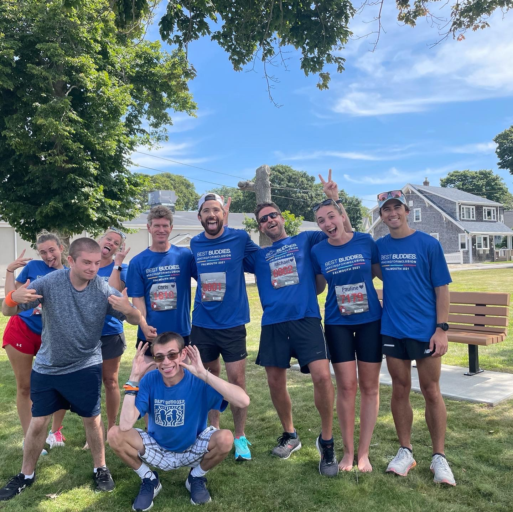

# [Best Buddies International](https://www.bestbuddies.org/)
Best Buddies is a nonprofit dedicated to establishing a global volunteer movement that creates opportunities for individuals with intellectual and developmental disabilities (IDD). I've been involved with them since graduating high school through fundraising and other local volunteer opportunities. I've been lucky enough to have participated with a team in the [Boston Marathon](https://results.baa.org/2023/?content=detail&fpid=search&pid=search&idp=9TGHS6FF1817C6&lang=EN_CAP&event=R&event_main_group=runner&pidp=start&search%5Bname%5D=dawley&search_event=R), among other fundraising events they hold throughout the year. 

<!-- I've also participated in and fundraised for the Falmouth Road Race, one of the premier running events during the summer in MA (see below). Although absolutely scorching, the race is a blast! At the end of my first time running I was half a degree short of being admitted to the hospital because my internal body temperature was so high. -->

<!-- Most recently, I have become a member of the team representing Best Buddies in the 127th Boston Marathon. I am absolutely ecstatic (and incredibly nervous) to have this honor. If you'd like to donate at all to my fundraising goal you can visit my [GivenGain](https://www.givengain.com/ap/sam-dawley-raising-funds-for-best-buddies-international-inc/#timeline) page. If you're still interested but do not have anything to give, no worries! You can follow my training (is suffering the better term?) on Strava (linked to the left). -->

    <figure>
        
        
<em>
            Best Buddies takes on the Falmouth Road Race! This was the same race I crossed the finish line ahead of olympic medalist Molly Seidel.
        </em>

    </figure>

# [Exceptional Citizens' Week at Camp Fatima](https://www.ecweek.org/)
EC Week at Camp Fatima is a week long camp that offers a genuine summer camp experience to campers with intellectual and/or physical disabilities (similar in spirit to Best Buddies). All of the activities are centered around the camper’s interests and each camper is catered to by a qualified, enthusiastic, and energetic volunteer staff, many of whom also consider the week a highlight in their lives. The counselors combine talents with the camp’s ample facilities to create a magical and memorable program while allowing campers to enjoy activities they might otherwise never have the opportunity to try. 

I've been volunteering at EC Week since before entering high school, serving myriad roles, and will continue to do so as long as I'm able. I can't completely express how amazing this week is, so, if you'd like to learn more I encourage checking out the EC Week website or alternatively asking me directly.