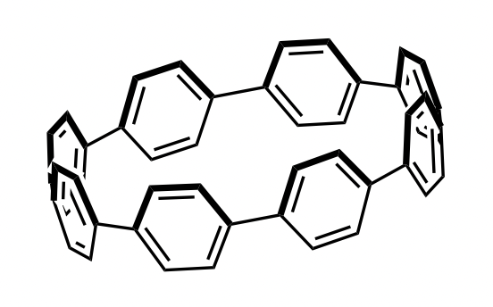

In the Tovar lab I studied physical organic chemistry while investigating cycloparaphenylenes (CPPs), macrocyclic aromatic compounds exhibiting hybrid linear and radial conjugation, and borepins, boron-containing heterocycles with interesting (anti)aromatic properties. Concurrently, I worked in the Cheng lab to study electronic structure theory using coupled-cluster methods to investigate compounds in opto-electronic traps at ultracold temperatures.

### Tovar Lab, Department of Chemistry
Undergraduate Research Assistant | *Winter 2020 - Spring 2023*

My original research project in the [Tovar lab](https://sites.krieger.jhu.edu/tovar-group/) involved cycloparaphenylenes (CPPs), macrocyclic aromatic compounds exhibiting hybrid linear and radial conjugation. The goals of the project ranged from optimization of synthetic conditions to molecular orbital characterization, both of which I accomplished while leaving behind promising research directions for future students. During this time, I gained expertise in fundamental techniques in organic synthesis, purification, and characterization, including NMR analysis and mass spectrometry. Some key accomplishments of my project include:

- Synthesis of functionalized [8]CPPs and optimized synthetic schemes for total synthesis. In the process, I synthesized a novel aromatic compound that may act as scaffolding for functionalized CPP precursors in the future.
- Molecular orbital characterization with density functional theory using Gaussian on high-powered computing clusters at the Advanced Research and Computing at Hopkins (ARCH, formerly MARCC) facility. In tandem, I wrote a Python script that communicates with the SSH client of ARCH facilities for automatic submission of jobs on computing clusters.

The second research project I adopted and am currently working on concerns the aromaticity of functionalized borepins and their derivatives. Probing aromaticity is done with the Aroma package for Gaussian, a computational plug-in that measures aromaticity using the nucleus-independent chemical shift (NICS) method. As part of my work I authored an *in-progress* SOP for using Aroma as well as a general introduction to the package, geared toward those with a background in organic chemistry. If you're interested in getting a hold of this pdf feel free to email me.

  <figure>
    
    
<em>
    An [8]CPP ring. The focues of my research in the Tovar lab was on substituted CPPs, so just imagine this ring but with some more stuff coming off of it.
    </em>

  </figure>

### Cheng Lab, Department of Chemistry
Undergraduate Research Assistant | *Spring 2022 - Spring 2023*

The overarching goal of my research in the [Cheng Lab](https://sites.krieger.jhu.edu/cheng/) involved investigating the properties of ionic and molecular diatoms in laser-cooled, ultracold opto-electronic traps. We have used coupled-cluster methods with the CFOUR computational suite to calculate the lifetimes and polarizabilities of such compounds and collaborated with experimentalists in the [Doyle Group](https://projects.iq.harvard.edu/jdoyle/home) at Harvard to corroborate results. The strong agreement between our results and those determined experimentally comes from our treatment of relativistic effects, which grow increasingly important as the trapped atoms grow heavier. Results include
- a peer-reviewed article published by the APS:

N. B. Vilas; C. Hallas; L. Anderegg; P. Robichaud; C. Zhang; **S. Dawley**; L. Cheng; J. M. Doyle; [Blackbody thermalization and vibrational lifetimes of trapped polyatomic molecules](https://journals.aps.org/pra/abstract/10.1103/PhysRevA.107.062802). *Phys. Rev. A* **107**, 062802 (2023).

- benchmark calculations of spin-orbit coupling in heavy-element molecules comparing perturbative and variational treatments. This work was presented to the American Chemical Society at the Spring 2023 Meeting in Indianapolis:

**S. Dawley**; C. Zhang; X. Zheng; L. Cheng. “Blackbody Thermalization and Vibrational Lifetimes of Trapped Polyatomic Molecules.” Presented at the National Meeting of the ACS, Indianapolis, IN, 2023.
