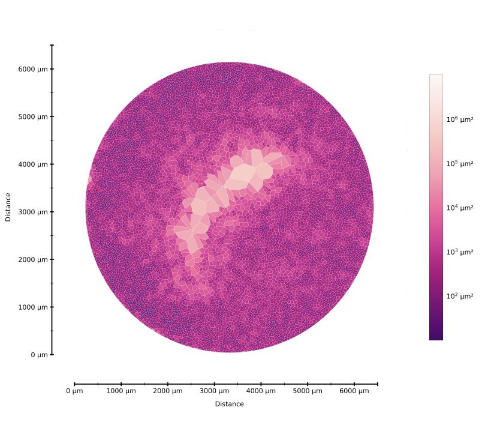

With the Dr. Tristan Kooistra and Dr. Benajamin Medoff at the Massachusetts General Hospital, I researched methods of data collection and visualization for studying the mechanisms involved with the inflammation of airway epithelium cells due to idiopathic pulmonary fibrosis (IPF). In particular, a coculture of basal cells and murine immune cells with IPF was created, maintained, and monitored to measure the heterogeneity of cell patterning as a function of time. I was responsible for culturing cells and recording the resultant patterning at different intervals. My primary contribution to the research project included a data visualization method and consequent method of analysis; I developed a Python program for determining cell-to-cell distances using a Delaunay triangulation and subsequent visualization using a Voronoi tessellation, an example of which can be found below. All of the code for the project can be found on [GitHub](https://github.com/sdawley1/Bio-Voronoi-Diagram).

  <figure>
    
    
<em> 
    Example visualization of cell patterning using my algorithm.
    </em>

  </figure>

<!-- HTML is better for image formatting -->

<!-- ### Markdown

 -->
